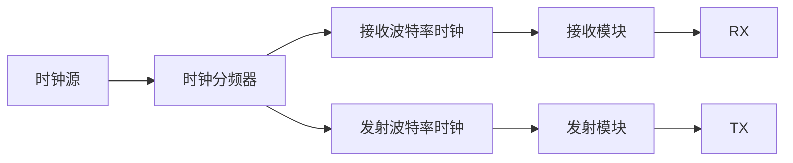

# Verilog-Modules

 Some modules in Verilog that you can easily copy to your code

# 时钟分频器

默认时钟为50MHz，也可以根据时钟频率自行修改计数值，来改变分频时钟的结果。

# 串口收发器

串口通信协议的实现也需要用的时钟分频，因为需要产生一定的波特率，顶层模块分为三部分：

- 接收模块
- 发送模块
- 分配模块

# VGA控制器

# FSM有限状态机
